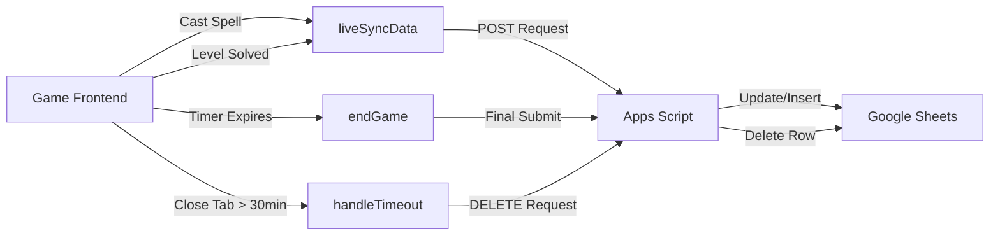

# 🪐 MagicFlex - Interactive CSS Flexbox Learning Game

<div align="center">


**Belajar CSS Flexbox dengan Cara yang Menyenangkan!**

*Game edukasi interaktif berbasis web untuk mempelajari CSS Flexbox melalui 25 misi progresif.*

[](https://developer.mozilla.org/en-US/docs/Web/HTML)
[](https://developer.mozilla.org/en-US/docs/Web/CSS)
[](https://developer.mozilla.org/en-US/docs/Web/JavaScript)
[](https://jquery.com/)
[](https://tailwindcss.com/)

[🎮 Demo](https://magicflex.vercel.app/) | [📚 Dokumentasi](#level-dan-materi) | [🚀 Instalasi](#instalasi) | [👥 Tim](#tim-pengembang)

</div>

---

## 📖 Daftar Isi

- [Tentang Proyek](#tentang-proyek)
- [Fitur Utama](#fitur-utama)
- [Tech Stack](#tech-stack)
- [Struktur File](#struktur-file) 
- [Instalasi](#instalasi) 
- [Cara Bermain](#cara-bermain) 
- [Sistem Scoring](#sistem-scoring) 
- [Integrasi Google Sheets](#integrasi-google-sheets) 
- [Level & Materi](#level-dan-materi) 
- [Konfigurasi](#konfigurasi) 
- [Tim Pengembang](#tim-pengembang) 
- [Lisensi](#lisensi) 

---
<a id="tentang-proyek"></a>
## 🎯 Tentang Proyek

**MagicFlex** adalah platform pembelajaran CSS Flexbox yang interaktif dan gamified. Siswa belajar dengan menyelesaikan 25 misi progresif, mendapat umpan balik secara langsung, pelacakan progres otomatis ke Google Sheets, dan masukan berbasis AI.

### 🌟 Keunggulan

- ✨ **Game-based Learning** - Belajar sambil bermain dengan misi menarik
- 🎨 **Visual Feedback** - Lihat hasil kode CSS secara langsung
- 📊 **Tracking Otomatis** - Data kemajuan tersimpan di Google Sheets
- 🤖 **AI-Powered Hints** - Bantuan cerdas dari Google Gemini AI
- ⏱️ **Timer System** - Tantangan 30 menit untuk mengasah fokus
- 🌐 **Multilingual** - Mendukung Bahasa Indonesia & English
- 📱 **Responsive Design** - Optimal di desktop dan mobile

---
<a id="fitur-utama"></a>
## 🚀 Fitur Utama

### 1. **Core Gameplay**
- 25 level progresif mengajarkan semua properti Flexbox
- Live code editor dengan validasi sintaks real-time
- Visual rendering langsung dari kode CSS
- Progress tracking dengan indikator visual
- Auto-save progress ke localStorage
- Navigasi level: Previous/Next + direct jump

### 2. **Sistem Timer**
- Countdown 30 menit per sesi
- Tampilan ganda (desktop & mobile)
- Auto-pause saat tab tidak aktif
- Sinkronisasi waktu real-time ke spreadsheet

### 3. **Integrasi Google Sheets**
- **Live Sync**: Data real-time selama gameplay
- **Auto-save**: Update otomatis saat level diselesaikan
- **Timeout Handler**: Submit otomatis saat waktu habis
- **Data Cleanup**: Hapus data stale session

### 4. **AI Feedback (Google Gemini)**
- Hint cerdas tanpa bocoran jawaban
- Analisis kesalahan kode CSS
- Saran perbaikan berbasis konteks
- Fallback UI jika API gagal

### 5. **Analisis Error**
- Parser CSS pintar deteksi syntax error
- Deteksi typo dengan algoritma Levenshtein
- Validasi properti Flexbox
- Error modal dengan pesan color-coded

### 6. **Progress Indicators**
- Visual dots grid (6 kolom)
- Status: Solved ✅, Current 🎯, Locked 🔒
- Klik navigasi ke level yang sudah dibuka

### 7. **Fitur Tambahan**
- WhatsApp sharing hasil final
- Reset game dengan konfirmasi
- View Transitions API untuk animasi smooth
- Interactive CSS tooltips dengan contoh

---
<a id="tech-stack"></a>
## 🛠️ Tech Stack

### Frontend
- **HTML5** - Struktur semantik
- **CSS3** - Styling & animasi custom
- **Tailwind CSS** (CDN) - Utility-first framework
- **jQuery 3.6.0** - DOM manipulation & event handling
- **SweetAlert2 v11** - Beautiful modals & popups

### Fonts & Icons
- **Google Fonts**: Space Grotesk, Libre Caslon Text
- **Material Symbols Outlined** - Icon library

### Backend Integration
- **Google Apps Script** - Server-side spreadsheet management
- **Google Gemini AI** - Intelligent feedback system
- **Google Sheets API** - Real-time progress tracking

---
<a id="struktur-file"></a>
## 📁 Struktur File

```
magicflex_2/
├── index.html                 # Landing page dengan intro game
├── game.html                  # Interface game utama
├── favicon.ico
├── google-apps-script.js      # Backend Apps Script untuk Sheets
├── SWEETALERT_FIX.md         # Dokumentasi fix SweetAlert2
├── README.md                  # Dokumentasi proyek (file ini)
│
├── css/
│   ├── style.css             # Main game styles (1581 baris)
│   └── custom.css            # Animasi & efek kustom (85 baris)
│
├── js/
│   ├── game.js               # Core game logic (2048 baris)
│   ├── levels.js             # 25 definisi level (281 baris)
│   ├── messages.js           # Dukungan multilingual (37 baris)
│   ├── docs.js               # Dokumentasi CSS tooltips (34 baris)
│   └── tailwind-config.js    # Konfigurasi tema Tailwind (135 baris)
│
└── images/
    ├── bg.png                # Background mistis
    ├── Bola*.svg             # Magic ball elements (Air, Api, Tanah)
    ├── portal*.png           # Portal target elements
    ├── alien-*.svg           # Karakter alien
    ├── planet-*.svg          # Dekorasi planet
    ├── element *.svg         # Elemen dekoratif (1-5)
    ├── *.jpg                 # Foto tim (Ima, Icha, Anike, Candra)
    └── Handout *.pdf         # Materi pembelajaran
```

---

<a id="instalasi"></a>
## 💻 Instalasi

### Prasyarat
- Web browser modern (Chrome, Firefox, Edge, Safari)
- Google Account untuk setup Sheets (opsional)

### Setup Lokal

1. **Clone repository**
   ```bash
   git clone https://github.com/username/magicflex.git
   cd magicflex
   ```

2. **Buka dengan live server**
   ```bash
   # Menggunakan Python
   python -m http.server 8000
   
   # Atau menggunakan Node.js
   npx live-server
   ```

3. **Akses di browser**
   ```
   http://localhost:8000/index.html
   ```

### Setup Google Sheets Integration

1. **Buat Google Spreadsheet baru**

2. **Setup Apps Script**
   - Buka Extensions > Apps Script
   - Copy isi file `google-apps-script.js`
   - Paste ke editor Apps Script
   - Save project

3. **Deploy sebagai Web App**
   - Klik Deploy > New deployment
   - Type: Web app
   - Execute as: Me
   - Who has access: Anyone
   - Copy Web App URL

4. **Update URL di game.js**
   ```javascript
   // Baris 34-35 di js/game.js
   googleScriptUrl: "PASTE_WEB_APP_URL_DISINI"
   ```

5. **Format Header Spreadsheet** (otomatis dibuat, atau manual):
   ```
   Timestamp | Nama | No Absen | Skor | Waktu Pengerjaan | Soal 1 (Tries) | Soal 1 (Status) | ... | Soal 25 (Status)
   ```

---
<a id="cara-bermain"></a>
## 🎮 Cara Bermain

### Alur Permainan

1. **🚀 Start Game**
   - Buka `game.html`
   - Masukkan Nama & No Absen
   - Timer 30 menit dimulai

2. **📝 Solve Levels**
   - Baca instruksi di panel kiri
   - Tulis kode CSS di editor "Grimoire"
   - Klik **Cast Spell** untuk test kode
   - Lihat hasil visual di panel kanan

3. **✅ Validasi**
   - Jika benar: Alien mencapai portal ✨
   - Jika salah: Error analysis muncul ❌
   - Klik **Lanjut Soal Berikutnya** untuk next level

4. **🏆 Finish**
   - Selesaikan 25 level atau waktu habis
   - Lihat hasil akhir & feedback AI
   - Share ke WhatsApp (opsional)

### Tombol & Kontrol

| Tombol | Fungsi |
|--------|--------|
| **Cast Spell** | Test kode CSS (dihitung sebagai percobaan) |
| **Lanjut Soal Berikutnya** | Validasi final & lanjut ke level berikutnya |
| **← →** | Navigasi Previous/Next level |
| **Progress Dots** | Klik untuk jump ke level tertentu |
| **Reset** | Mulai ulang dari level 1 (dengan konfirmasi) |

### Tips Bermain

💡 **Gunakan tooltip**: Klik kata `code` di instruksi untuk melihat dokumentasi CSS  
💡 **Test berkala**: Klik Cast Spell untuk lihat efek setiap perubahan  
💡 **Baca error**: Error analysis memberikan hint spesifik  
💡 **Manfaatkan AI**: Klik "Dapatkan Masukan dari Gemini AI" jika stuck  
💡 **Kelola waktu**: 30 menit untuk 25 level = ~1.2 menit per level  

---
<a id="sistem-scoring"></a>
## 📊 Sistem Scoring

### Perhitungan Skor

```javascript
Score = (Jumlah Level Solved / 25) × 100%
```

### Data yang Dicatat

**Per Siswa:**
- Nama
- No Absen
- Skor akhir (%)
- Waktu pengerjaan (max 30 menit)
- Timestamp submission

**Per Level (1-25):**
- **Tries**: Jumlah klik "Cast Spell" + "Lanjut Soal Berikutnya"
- **Status**: "Benar" atau "Salah"

### Performance Level

| Skor | Badge | Warna |
|------|-------|-------|
| ≥ 90% | 🌟 Excellent! | Hijau |
| 80-89% | 🎯 Very Good! | Biru |
| 70-79% | 👍 Good! | Ungu |
| 60-69% | 📈 Fair | Orange |
| < 60% | 💪 Keep Trying! | Merah |

---
<a id="integrasi-google-sheets"></a>
## 🔗 Integrasi Google Sheets

### Alur Data



### Fungsi Backend (Apps Script)

#### **doPost(e)**
Menerima POST request dari frontend:

**Actions:**
- **Default**: Update/insert data siswa
- **`action=delete`**: Hapus baris siswa (cleanup session stale)

**Validasi:**
- Nama & No Absen wajib
- Proteksi bug: Hapus data jika waktu > 30 menit

**Data Stored:**
```javascript
{
  Timestamp: Date,
  Nama: String,
  Absen: String,
  Skor: Number (0-100),
  Waktu Pengerjaan: String ("XX menit YY detik"),
  "Soal 1 (Tries)": Number,
  "Soal 1 (Status)": String ("Benar"/"Salah"),
  // ... repeat for Soal 2-25
}
```

### Business Rules

| Skenario | Data di Spreadsheet |
|----------|---------------------|
| Timer countdown habis (30:00 → 0:00) saat siswa aktif | ✅ **TERSIMPAN** |
| Siswa close website, buka lagi setelah > 30 menit | ❌ **DIHAPUS** |
| Bug sistem mengirim waktu > 30 menit | ❌ **DIHAPUS** (proteksi) |

### Format Spreadsheet

```
| Timestamp        | Nama    | No Absen | Skor | Waktu Pengerjaan | Soal 1 (Tries) | Soal 1 (Status) | ... |
|------------------|---------|----------|------|------------------|----------------|-----------------|-----|
| 9/14/2026 08:30  | Chandra | 01       | 92   | 28 menit 15 detik| 2              | Benar           | ... |
```

**Warna Cell:**
- 🟢 Hijau (#d9ead3): Status "Benar"
- 🔴 Merah (#f4cccc): Status "Salah"
- ⚪ Putih (#ffffff): Belum dikerjakan

---

<a id="level-dan-materi"></a>
## 📚 Level & Materi

### 25 Level Progresif

#### **Levels 1-4: `justify-content`**
Konsep: Perataan horizontal (main axis)
- Level 1: `flex-end`
- Level 2: `center`
- Level 3: `space-around`
- Level 4: `space-between`

#### **Levels 5-7: `align-items`**
Konsep: Perataan vertikal (cross axis)
- Level 5: `flex-end`
- Level 6-7: Kombinasi dengan `justify-content`

#### **Levels 8-10: `flex-direction`**
Konsep: Arah sumbu utama
- Level 8: `row-reverse`
- Level 9: `column`
- Level 10: Kombinasi dengan alignment

#### **Levels 11-13: Kombinasi Lanjut**
Konsep: Memahami axis-switching behavior

#### **Levels 14-17: `order` & `align-self`**
Konsep: Manipulasi individual item
- Level 14-15: `order` property
- Level 16-17: `align-self` override

#### **Levels 18-20: `flex-wrap` & `flex-flow`**
Konsep: Multi-line layouts
- Level 18-19: `wrap` & `wrap-reverse`
- Level 20: `flex-flow` shorthand

#### **Levels 21-24: `align-content`**
Konsep: Spacing untuk multi-line
- Kombinasi kompleks dengan wrap

#### **Level 25: Final Exam**
Konsep: Challenge gabungan semua properti

### Dokumentasi CSS (docs.js)

Tooltips interaktif untuk:
- `align-content`
- `align-items`
- `align-self`
- `flex-direction`
- `flex-flow`
- `flex-wrap`
- `justify-content`
- `order`

**Cara Akses**: Klik `<code>` element di instruksi level

---
<a id="konfigurasi"></a>
## ⚙️ Konfigurasi

### Tailwind Theme (js/tailwind-config.js)

**Material Design 3 Color Tokens:**
```javascript
colors: {
  primary: '#7D4EFA',
  secondary: '#7B61FF',
  tertiary: '#6366F1',
  surface: {
    dim: '#1a1c2e',
    bright: '#2d3250',
    container: {
      lowest: '#0f1117',
      low: '#181a25',
      DEFAULT: '#1f212e',
      high: '#2a2d3a',
      highest: '#343746'
    }
  },
  // ... dan lainnya
}
```

**Typography Scale:**
```javascript
fontFamily: {
  'body-md': ['Space Grotesk'],
  'headline-lg': ['Space Grotesk', 'bold'],
  'display': ['Libre Caslon Text']
}
```

### Multilingual (js/messages.js)

**Bahasa Tersedia:**
- English (`en`)
- Bahasa Indonesia (`id`)

**Cara Ganti Bahasa:**
```javascript
// Di game.js
game.language = 'en'; // atau 'id'
```

**Note**: Level instructions saat ini hanya Bahasa Indonesia

---

## 🐛 Troubleshooting

### SweetAlert2 Tidak Muncul

**Gejala**: Modal tidak muncul di GitHub Pages

**Solusi**: Sudah diterapkan di proyek (lihat `SWEETALERT_FIX.md`)
- CDN updated ke latest v11
- AlertHelper fallback system
- Extended wait logic (10s timeout)
- Try-catch wrappers semua `Swal.fire()`

### Data Tidak Tersimpan ke Spreadsheet

**Checklist:**
1. ✅ Apps Script sudah di-deploy sebagai Web App?
2. ✅ URL di `game.js` baris 34-35 sudah benar?
3. ✅ Permission "Anyone" di deployment settings?
4. ✅ Cek browser console untuk error fetch

**Debug:**
```javascript
// Di browser console
localStorage.getItem("playerName")
localStorage.getItem("playerAbsence")
```

### Timer Tidak Berjalan

**Penyebab Umum:**
- Browser tab tidak aktif (intended behavior - auto-pause)
- localStorage corrupt

**Solusi:**
```javascript
// Reset localStorage
localStorage.clear();
location.reload();
```

### Level Tidak Bisa Dibuka

**Penyebab**: Level sebelumnya belum diselesaikan

**Cek Status:**
```javascript
// Di browser console
game.solved // Array level yang sudah solved
game.level  // Current level (0-24)
```

---

<a id="tim-pengembang"></a>
## 👥 Tim Pengembang

<table>
  <tr>
    <td align="center">
      <br/>
      <b>Ima Umiatul Chusnah</b><br/>
    </td>
    <td align="center">
      <br/>
      <b>Hanydhar Rose Manicha</b><br/>
    </td>
    <td align="center">
      <br/>
      <b>Maridho Anike Putri</b><br/>
    </td>
    <td align="center">
      <br/>
      <b>Candra Febriyanto</b><br/>
    </td>
  </tr>
</table>

---
<a id="lisensi"></a>
## 📄 Lisensi

Project ini dibuat untuk tujuan edukasi.

---

## 🙏 Acknowledgments

- **SweetAlert2** - Beautiful modal library
- **jQuery** - DOM manipulation
- **Tailwind CSS** - Utility-first CSS framework
- **Google Fonts** - Space Grotesk & Libre Caslon Text
- **Material Design 3** - Color system inspiration
- **Flexbox Froggy** - Gameplay concept inspiration
- **Google Gemini AI** - Intelligent feedback system

---

## 📞 Kontak

Untuk pertanyaan, saran, atau bug report, silakan buka [WhatsApp Developer](https://wa.me/+6287769006246).

---

<div align="center">

**Made with 💜 by MagicFlex Team**

⭐ Star project ini jika bermanfaat!

</div>
